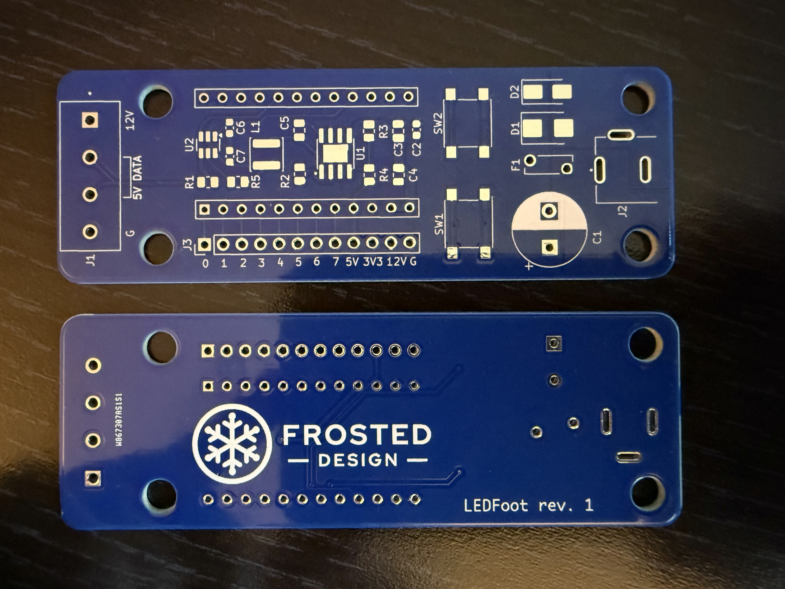
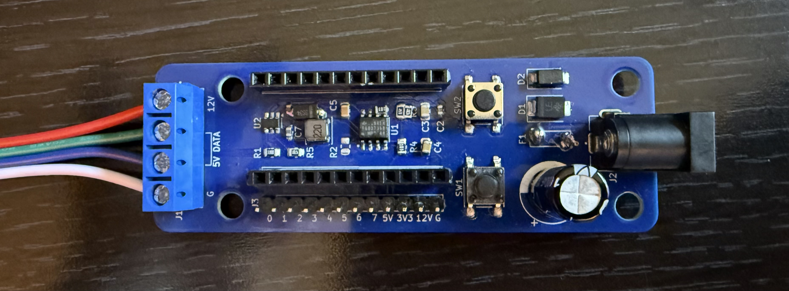
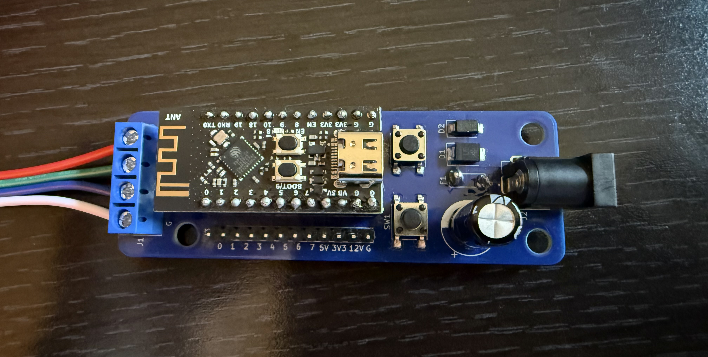

# LEDFoot

An expansion board for the [WeAct Studio ESP32-C3Fx4](https://github.com/WeActStudio/WeActStudio.ESP32C3CoreBoard?tab=readme-ov-file)
family of development boards, supporting a 12V power supply for 12V WS2815 LED strips and other 12V LED chains with 3-4
pins and a sequential data line. KiCad.

## Features

* 12V input, 8A max rating
* Reverse polarity protection
* Transient power spike protection
* Over-voltage and over-amperage protection
* Ample onboard capacitance to reduce flicker and power overdraw
* 5V data signal
* Breakout pins for GPIOs 0-7 of the ESP32-C3, including 6 analog pins
* 3.3V, 5V, 12V, and GND breakout pins
* Two tactile buttons (GPIO 8 and 9)
* Configurable data line on GPIO 10
* Supports WLED and any other software that can be flashed to the ESP32-C3

## Revisions

### rev 1 (2025-01)

#### Status

Printed and functional, with assembly modifications. Assembling as-is results in a damaged resistor (R2) and
non-functional buck converter circuit that fails to power the ESP32 board.

#### Required modifications

1. An additional SS34 Schottky diode (same as D2) must be wired reverse-biased from GND to the input side of the L1
  Inductor. There is space for this on the right side of L1, connecting to the left side of C6. Solder bridges are easy
here.
2. A resistor (Ideally 100k Ohms, but any in the 10k - 250k range will work) must be connected between pin 5 (GND) and
   pin 6 (FREQ) of the MP1584EN chip (U1). This is easy to place directly on the pads for these two pins, because they
are adjacent on the right side of the chip.
3. The voltage divider resistors for the MP1584EN chip, R3 and R4, are not properly configured to supply 5V. There are
   many solutions to this. With an already-assembled board and only with access to the original BOM, I solved it by
adding a 4.7k resistor in parallel with the R3 3.3k resistor, simply by soldering to the same R3 pads. They are large
enough to accommodate both resistors side by side. This results in an approx 4.8V output, which is sufficient.
4. Remove the R2 resistor, which leaves the EN pin of the MP1584EN chip (U1) floating. Per the data sheet, this is fine
   as EN is pulled up internally. Note that this is not confirmed to be a hard requirement, however this resistor did
burn out without the modifications above.
5. The footprint of the RUEF800 fuse (F1) is larger than the board allows. To accomodate, mount this fuse to the
   underside of the board, bending the legs so that it can lay flat, parallel to the board. Allow space for
ventillation, and ensure that any case or mounting solution used does not apply pressure to the fuse or damage it
against the legs of the other through-hole components. Solder the legs on both sides of the board, as this is
a high-current component that requires an extremely secure connection.

## Disclaimer

I am a self-taught hobbyist, not a credentialed electrical engineer. Voltage and current ratings are theoretical and
not thoroughly tested in a lab environment. I am not liable for any use of these designs, derivations of these designs,
or any destruction of property or loss of life that may result. Use of these designs is prohibited, and any choice to
do otherwise is made at your own risk.

## License

These designs are published as an educational tool only. The designs, as well as any part manufactured according to
these designs or a derivation thereof, may not be modified, produced, sold, or used as part of another design or
product. These designs are wholly owned by their creator, with all applicable rights reserved.

