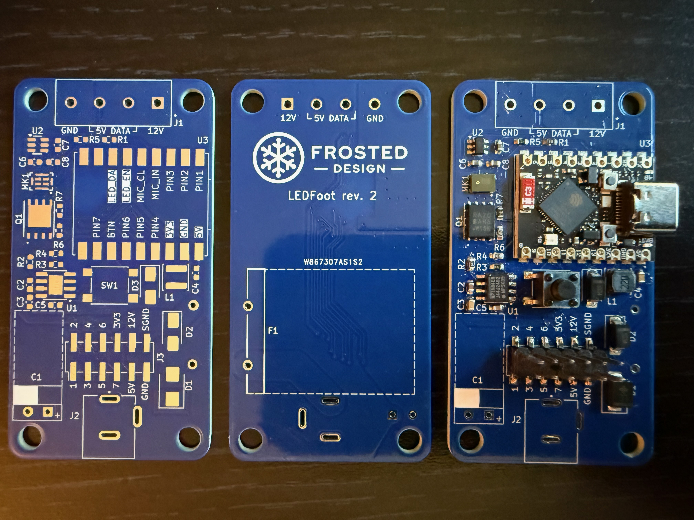

# LEDFoot

Control board for WS2815 and other 3-4 pin individually addressable LED strips that operate at 12V. Drivable by various inexpensive ESP32 dev boards. KiCad.

## Features

* 12V input, 8A max rating
* Sound-reactive support with onboard mic
* Wide range of ESP32 dev board support
  * ESP32-S3 (audio reactive **supported**)
    * ESP32-S3 Super Mini [[Info](https://www.espboards.dev/esp32/esp32-s3-super-mini/)] [[Aliexpress](https://www.aliexpress.us/item/3256807337822466.html)]
    * Seeed Studio XIAO ESP32S3 [[Info](https://wiki.seeedstudio.com/xiao_esp32s3_getting_started/)] [[Aliexpress](https://www.aliexpress.us/item/3256807240469656.html)]
  * ESP32-C3 (audio-reactive **not supported**)
    * ESP32-C3 Super Mini [[Info](https://wiki.icbbuy.com/doku.php?id=developmentboard:esp32-c3mini#schematic)] [[Aliexpress](https://www.aliexpress.us/item/3256806846231704.html)]
    * Seeed Studio XIAO ESP32C3 [[Info](https://wiki.seeedstudio.com/XIAO_ESP32C3_Getting_Started/)] [[Aliexpress](https://www.aliexpress.us/item/3256806641821574.html)]
  * Potentially more: Any board with 14-18 pins and 5V, GND, 3.3V to the RIGHT of the USB port may be compatible.
    * Waveshare Zero boards are not compatible: their power pins are on the left side.
* Reverse polarity protection
* Transient power spike protection
* Over-voltage and over-amperage protection
* Power-save mode when lights are off
* Ample onboard capacitance to reduce flicker and power overdraw
* 5V data signal
* 12 breakout pins for customizations, including 5 power pins: 12V, 5V, 3.3V, Ground, and Switched Ground (disconnects when LEDs are off)
* 3.3V, 5V, 12V, and GND breakout pins
* Tactile button
* Configurable data line
* Supports WLED and any other software that can be flashed to the ESP32-C3

## Revisions

### rev 2 (2025-02) (Super Mini Board footprint version)

#### Changes

* Made 5V buck converter corrections outlined in rev 1
* Corrected RUEF800 fuse footprint, kept on the back of the board
* Switched from through-hole headers to SMD headers to avoid puncturing RUEF800
* Added on-board SMD microphone for sound-reactivity
* Reduced buttons to 1. Figuring out which of those two little buttons you had your finger on was terrible if the board was mounted out of sight.
* Added a high-current logic-level MOSFET as a non-mechanical relay to shut off power to the LED strip when off, saving significant energy.

#### Status

* Printed and not fully tested
* Onboard mic works wonderfully when the ESP32 daughterboard is powered via USB, but not 12V. This is due to too much ripple on the 5V rail. There are a few potential reasons for this; the largest was the decision to leave COMP on the MP1584EN floating to save space. This didn't cause an issue until adding the PDM mic, which is very sensitive to this noise. Its signal is nearly always high as a result.

### rev 1 (2025-01) (WeAct Studio ESP32-C3Fx4 version)

#### Intended Features

* Powered by the [WeAct Studio ESP32-C3Fx4](https://github.com/WeActStudio/WeActStudio.ESP32C3CoreBoard?tab=readme-ov-file)
family of development boards
* 12V input, 8A max rating
* Reverse polarity protection
* Transient power spike protection
* Over-voltage and over-amperage protection
* Ample onboard capacitance to reduce flicker and power overdraw
* 5V data signal
* Breakout pins for GPIOs 0-7 of the ESP32-C3, including 6 analog pins
* 3.3V, 5V, 12V, and GND breakout pins
* Two tactile buttons (GPIO 8 and 9)
* Configurable data line on GPIO 10
* Supports WLED and any other software that can be flashed to the ESP32-C3

#### Status

Printed and functional, with assembly modifications. Assembling as-is results in a damaged resistor (R2) and
non-functional buck converter circuit that fails to power the ESP32 board.

#### Required modifications

1. An additional SS34 Schottky diode (same as D2) must be wired reverse-biased from GND to the input side of the L1
  Inductor. There is space for this on the right side of L1, connecting to the left side of C6. Solder bridges are easy
here.
2. A resistor (Ideally 100k Ohms, but any in the 10k - 250k range will work) must be connected between pin 5 (GND) and
   pin 6 (FREQ) of the MP1584EN chip (U1). This is easy to place directly on the pads for these two pins, because they
are adjacent on the right side of the chip.
3. The voltage divider resistors for the MP1584EN chip, R3 and R4, are not properly configured to supply 5V. There are
   many solutions to this. With an already-assembled board and only with access to the original BOM, I solved it by
adding a 4.7k resistor in parallel with the R3 3.3k resistor, simply by soldering to the same R3 pads. They are large
enough to accommodate both resistors side by side. This results in an approx 4.8V output, which is sufficient.
4. Remove the R2 resistor, which leaves the EN pin of the MP1584EN chip (U1) floating. Per the data sheet, this is fine
   as EN is pulled up internally. Note that this is not confirmed to be a hard requirement, however this resistor did
burn out without the modifications above.
5. The footprint of the RUEF800 fuse (F1) is larger than the board allows. To accomodate, mount this fuse to the
   underside of the board, bending the legs so that it can lay flat, parallel to the board. Allow space for
ventillation, and ensure that any case or mounting solution used does not apply pressure to the fuse or damage it
against the legs of the other through-hole components. Solder the legs on both sides of the board, as this is
a high-current component that requires an extremely secure connection.

## Disclaimer

I am a self-taught hobbyist, not a credentialed electrical engineer. Voltage and current ratings are theoretical and
not thoroughly tested in a lab environment. I am not liable for any use of these designs, derivations of these designs,
or any destruction of property or loss of life that may result. Use of these designs is prohibited, and any choice to
do otherwise is made at your own risk.

## License

These designs are published as an educational tool only. The designs, as well as any part manufactured according to
these designs or a derivation thereof, may not be modified, produced, sold, or used as part of another design or
product. These designs are wholly owned by their creator, with all applicable rights reserved.
